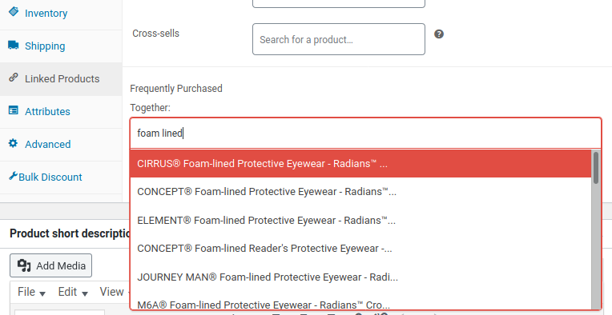
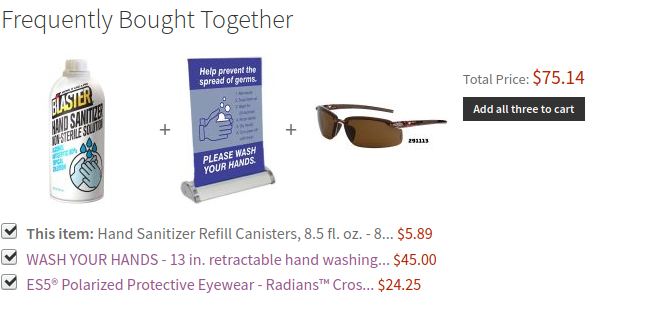

# Frequently Bought Together for WooCommerce
> Brings 'frequently bought together' functionality to WooCommerce.

## Table of contents
* [General info](#general-info)
* [Screenshots](#screenshots)
* [Setup](#setup)
* [Features](#features)
* [Status](#status)
* [Inspiration](#inspiration)
* [Contact](#contact)

## General info
Allows admins to link products together as "frequently purchased together" and add multiple items to the cart at the same time. The form is dynamic - changing the url and button text - as items are checked on and off.

## Screenshots
### Back End 

### Product Page 

## Setup
1. Download the plugin
2. Install
3. Go to Edit Product > Related Items
4. Add a few products
5. Go to product page to test

## Features
List of features ready and TODOs for future development
* Select2 input box for easy adding of product IDS on related products tab
* Dynamic add to cart form - allowing users to easily remove specific items while adding the rest to cart
* Allows adding multiple items to the cart on the click of a button

## To-do list:
* Create table which would allow reverse look ups - A + B on both product A's page & B's.
* Improve mobile view

## Status
Project is: _in progress_

## Inspiration
Special shoutout to [@jtsternberg](https://dsgnwrks.pro/snippets/woocommerce-allow-adding-multiple-products-to-the-cart-via-the-add-to-cart-query-string/) for providing the hack for adding multiple products to cart.

## Contact
Created by [@gerrgg](http://gerrg.com/) - feel free to contact me!
